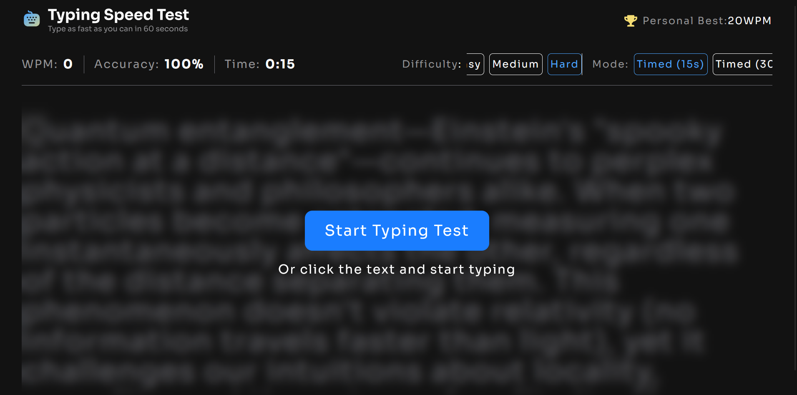
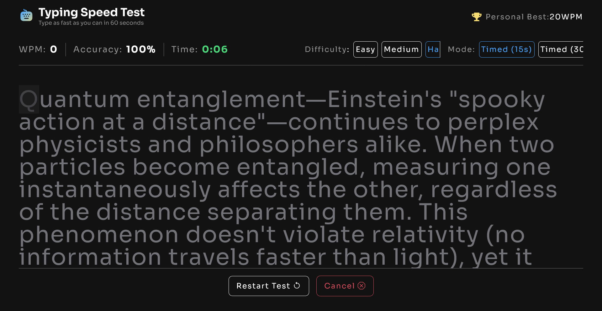
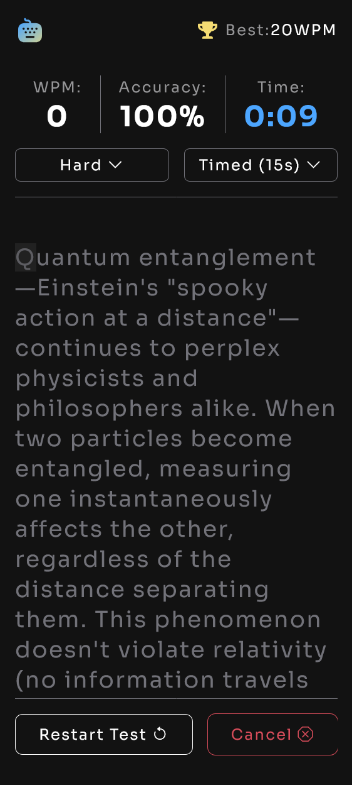

# Frontend Mentor - Typing Speed Test solution

This is a solution to the [Typing Speed Test challenge on Frontend Mentor](https://www.frontendmentor.io/challenges/typing-speed-test). Frontend Mentor challenges help you improve your coding skills by building realistic projects.

## Table of contents

- [Overview](#overview)
  - [The challenge](#the-challenge)
  - [Screenshot](#screenshot)
  - [Links](#links)
- [My process](#my-process)
  - [Built with](#built-with)
  - [What I learned](#what-i-learned)
  - [Continued development](#continued-development)
  - [Useful resources](#useful-resources)
- [Author](#author)
- [Acknowledgments](#acknowledgments)

## Overview

### The challenge

Users should be able to:

- View the optimal layout for the interface depending on their device's screen size
- See hover and focus states for all interactive elements on the page
- Start a typing test by clicking the start button, clicking on the text or just typing on keyword (only letters or numbers)
- Switch between different levels including: easy, medium, hard, quote and code
- Use different timing modes including: 15s, 30s, 60s, 120s and Passage mode
- View the history by clicking on the history button on top of personnel best and clear it for a specific level
- Get visual feedback for the word per minute, accuracy and time change while typing
- See the final results when timer ends or when the typing text is completed

Get up and running with few steps:

- Clone the repo
  ```bash
  git clone git@github.com:vickbk/typing-speed-test.git
  ```
- Install the dependancies
  ```bash
  pnpm install
  ```
- Start the server
  ```bash
  pnpm dev
  ```
- Build a production preview
  ```bash
  pnpm build
  ```
- Preview the built file
  ```bash
  pnpm preview
  ```

### Screenshot





### Links

- Solution URL: [Github Repo](https://github.com/vickbk/typing-speed-test/)
- Live Site URL: [Github pages](https://vickbk.github.io/typing-speed-test/)

## My process

### Built with

- Semantic HTML5 markup
- CSS custom properties
- Mobile-first workflow
- [SASS](https://sass-lang.com/) - CSS Preprocessor
- [Tailwindcss](https://tailwindcss.com/) - CSS framework
- [React](https://reactjs.org/) - JS library
- [Vite](https://vite.dev/) - A build tool for the web

### What I learned

In this project I learnt to work with react useReducer hook which simplified the state management through out the entire application when combined with context.

```js
function myReducer(states, { action, payload }) {
  const actionsList = {
    someCustomAction() {
      return { ...states, someParameter: payload };
    },
  };
  return actionsList?.[action]();
}

// Then calling it like combined with context:
// A pure joy
const { state, dispatch } = useContext(SomeContext);
dispatch({ action: "someCustomAction", payload: 12 });
```

Here we use the custom 404.html option provided by github pages to run a redirection to the actual link of the project and then transform it back to the original link.

### Continued development

Still learning and practicing.

### Useful resources

- [Roadmap](https://roadmap.sh) - Helping me get hands on structured learning paths for frontend knowledge.

- [Frontend Mentor](https://www.frontendmentor.io) - Helping get hands on practice projects.

- [SPA Githb Pages repository](https://github.com/rafgraph/spa-github-pages) - from here I learnt how to use routing with github pages since github pages does not fully support client-routing out-of the box. I used the redirection idea provided by [Raph Graph](https://github.com/rafgraph).

- [How To Type](https://www.how-to-type.com/typing-practice/programming/) - I got some python and javascript code snippets from this site that I am using on this project.

- [Key Hero](https://www.keyhero.com/quotes/) - For quotes I used some of the ones provided on this site as well.

## Author

- Github - [@vickbk](https://github.com/vickbk)
- Frontend Mentor - [@vickbk](https://www.frontendmentor.io/profile/vickbk)
- Twitter - [@Vick_bk8](https://x.com/Vick_bk8)

## Acknowledgments

For this project I use most of the knowlegde I got from the frontend roadmap, frontendmentor for HTML & css tricks and technics, accessibility and various developement techniques...
